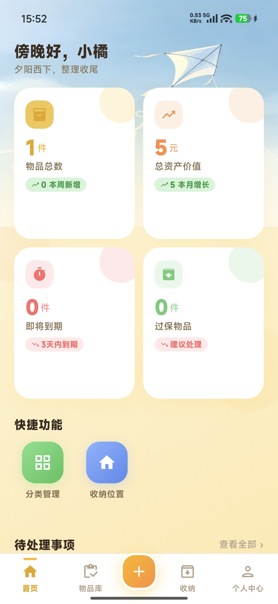
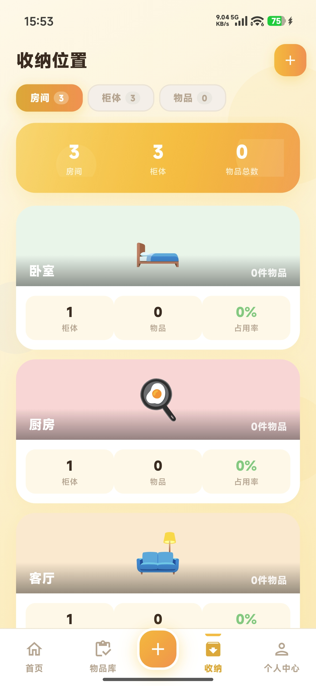
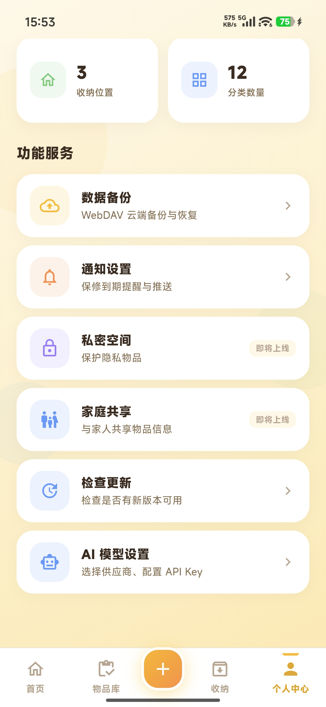
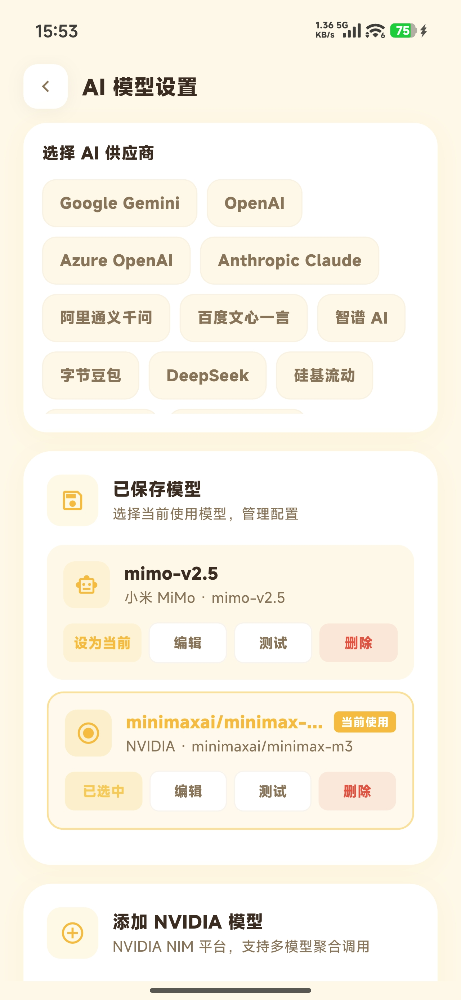

<div align="right">
  <strong>简体中文</strong> | <a href="./README.md">English</a>
</div>

<div align="center">
  
  <h1>拾物记 (ShiWuJi) — 家居物品收纳管理 App</h1>
  <p><strong>从此不再忘记东西放在哪里。</strong></p>
  <p>记录位置 · 分类管理 · 保修追踪 · AI 识别 · 多端同步</p>
  <p>
    
    
  </p>
</div>

---

## 📖 拾物记是什么

你是否有过这样的经历：明明记得家里有个东西，却翻箱倒柜找不到？买了一堆同类物品，却不记得已经有哪些了？

**拾物记帮你解决这些烦恼。**

它是一款基于 Flutter 的家居物品收纳管理 App，帮你记录每件物品的存放位置、分类信息、购买日期和保修状态。支持 AI 拍照识别、电商订单批量导入和 WebDAV 云备份，让你的物品管理井井有条。

---

## 📱 截图

<table>
  <tr>
    <td align="center"><sub>首页概览，一目了然</sub></td>
    <td align="center"><sub>分类管理，井井有条</sub></td>
    <td align="center"><sub>房间→柜子→格子，精准定位</sub></td>
    <td align="center"><sub>保修到期，自动提醒</sub></td>
    <td align="center"><sub>拍照识别，自动录入</sub></td>
  </tr>
</table>

---

## ✨ 功能特性

- **🤖 AI 拍照识别**：拍张照片，AI 自动填充名称、品牌、分类。支持 18+ AI 服务商。
- **📦 物品管理**：记录名称、价格、分类、存放位置、购买日期、保修天数、照片、品牌、备注等。
- **🏠 空间层级**：房间 → 柜子 → 格子 → 物品，四级结构精确定位。
- **⏰ 保修追踪**：自动计算保修到期，首页展示即将到期、已过期和在保物品统计。
- **📂 分类管理**：12 个内置分类（数码、家电、护肤、厨房、衣物、书籍、收纳、玩具、运动、文具、钥匙、工具），支持自定义扩展。
- **📥 订单导入**：一键导入电商平台订单，批量生成物品记录。
- **📊 统计卡片**：首页展示物品总数、资产总值（千位分隔）、本周新增、本月增长。
- **🔍 物品筛选**：按分类 / 保修状态筛选；按时间 / 价格 / 到期日排序。
- **🗄️ 空间管理**：房间、柜子、格子三级空间管理，实时查看占用情况。
- **☁️ WebDAV 备份**：连接任意 WebDAV 服务（坚果云、Nextcloud 等），备份和恢复数据库。
- **🔄 更新检查**：从 GitHub Releases 拉取最新版本信息，App 内提示更新。
- **🔔 本地通知**：保修到期提醒。
- **🔒 数据加密**：基于 PBKDF2 + AES 的数据库加密。
- **📱 多平台支持**：Android / iOS / Windows / Linux / Web。

---

## 🧠 设计理念

拾物记的设计围绕一个核心问题：**如何用最少的操作，管理最多的物品。**

常见的管理方式要么依赖大脑记忆，要么需要在笔记里手动维护表格。前者容易遗忘，后者维护成本高、难以坚持。

拾物记的方案是：

- **空间即结构**：物品的存放位置天然具有层级关系，拾物记用"房间→柜子→格子"三级空间直接对应现实场景，录入时选位置就像把东西放进柜子里一样自然。
- **AI 降低录入门槛**：拍照识别和订单导入让新建物品记录几乎零成本，解决了"懒得记"的问题。
- **自动化带来安心**：保修自动计算、到期自动提醒、数据自动加密备份 —— 你只管用，剩下交给 App。

---

## 🆚 和其他方案的差异

| 功能 | 拾物记 | 笔记类 (Notion/飞书) | 通用清单 App | Excel 手动管理 |
|---|---|---|---|---|
| **空间层级管理** | ✅ 四级结构 | ❌ 需手动搭建 | ❌ | ⚠️ 需手动搭建 |
| **AI 拍照识别** | ✅ 18+ 服务商 | ❌ | ❌ | ❌ |
| **电商订单导入** | ✅ | ❌ | ❌ | ❌ |
| **保修自动追踪** | ✅ | ❌ | ❌ | ❌ |
| **WebDAV 云备份** | ✅ | ✅ | ⚠️ 部分支持 | ❌ |
| **数据加密** | ✅ PBKDF2+AES | ⚠️ 部分支持 | ⚠️ 部分支持 | ❌ |
| **多平台** | ✅ 5 平台 | ✅ | ⚠️ 部分支持 | ✅ |
| **开源** | ✅ MIT | ❌ | ❌ | ✅ |
| **学习成本** | 低 — 打开即用 | 中 — 需搭建模板 | 低 | 中 — 需公式 |

---

## 🗺️ 开发规划

### ✅ 1 · 核心功能
- [x] 物品 CRUD（名称、价格、分类、位置、照片、品牌、备注）
- [x] 四级空间管理（房间 → 柜子 → 格子 → 物品）
- [x] 12 内置分类 + 自定义扩展
- [x] 保修计算 + 到期提醒
- [x] AI 拍照识别（18+ 服务商）
- [x] 电商订单批量导入
- [x] WebDAV 云备份 / 恢复
- [x] 数据库加密（PBKDF2 + AES）
- [x] 多平台：Android / iOS / Windows / Linux / Web

### 🚧 2 · 体验提升
- [ ] 物品搜索（全文检索）
- [ ] 物品标签系统
- [ ] 批量编辑物品
- [ ] 导出数据（CSV / JSON）

### 🔭 3 · 智能功能
- [ ] 物品过期提醒（食品、药品等）
- [ ] 物品价值统计报表
- [ ] 搬家模式（批量导出 / 导入空间结构）

### 🔭 4 · 生态
- [ ] 物品模板市场
- [ ] 家庭共享空间

---

## 🧑‍💻 给开发者

### 🚀 快速开始

```bash
git clone git@github.com:bron1117/wupin.git
cd wupin
flutter pub get
dart run build_runner build
flutter run
```

### 代码生成

修改 `models/`、`database/tables/` 或 `providers/` 后重新运行：

```bash
dart run build_runner build

# 开发时使用 watch 模式
dart run build_runner watch
```

### 测试

```bash
flutter test                                  # 全部测试
flutter test test/services/                   # 仅服务层测试
flutter test --coverage                       # 生成覆盖率报告
```

### 构建发布

#### Android

```bash
flutter build apk --split-per-abi             # 按 ABI 拆分 APK
flutter build appbundle                       # AAB（Play Store）
```

签名配置在 `android/key.properties`（不提交），由 `android/app/build.gradle.kts` 读取。

#### Windows / Linux / Web

```bash
flutter build windows
flutter build linux
flutter build web --release
```

---

## 🛠️ 技术栈

| 类别 | 技术 | 用途 |
|---|---|---|
| UI 框架 | Flutter + Material 3 | 跨平台 UI |
| 状态管理 | Riverpod + riverpod_annotation (codegen) | 单向数据流 |
| 路由 | go_router (StatefulShellRoute) | 底部导航路由 |
| 网络请求 | dio | HTTP 请求 |
| 本地存储 | drift (SQLite ORM) | 数据库 |
| 云备份 | webdav_client | WebDAV 备份 / 恢复 |
| 数据模型 | freezed + json_serializable | 不可变数据模型 |
| 通知 | flutter_local_notifications | 本地通知 |
| 加密 | crypto (PBKDF2 + AES-256) | 数据库加密 |
| 图片 | image_picker + photo_view | 拍照 / 图片浏览 |
| 版本信息 | package_info_plus | App 版本、构建号 |
| 浏览器跳转 | url_launcher | 链接跳转 |

---

## 📁 目录结构

```
lib/
├── main.dart                     # 应用入口
├── app_router.dart               # 路由配置（5 Tab + 详情/编辑子路由）
├── constants/                    # 主题色、字号、阴影、输入样式
├── database/                     # drift 数据库定义
│   ├── database.dart             # 数据库实例、迁移策略、种子数据
│   ├── seed_data.dart            # 首次安装种子数据
│   └── tables/                   # 8 张表定义
├── daos/                         # 数据访问层
├── models/                       # freezed 数据模型 + 枚举
│   └── enums/                    # ItemStatus / SortType / TabType / PendingCardType
├── providers/                    # Riverpod 状态管理
├── services/                     # 业务服务
│   ├── ai/                       # AI 识别服务（18+ 服务商）
│   ├── http_service.dart         # dio 封装
│   ├── update_service.dart       # GitHub Releases 版本检查
│   ├── webdav_service.dart       # WebDAV 备份/恢复
│   ├── encryption_service.dart   # PBKDF2 + AES 加密
│   ├── notification_service.dart # 本地通知
│   ├── photo_service.dart        # 相机/相册选择
│   └── prompt_service.dart       # AI 提示词管理
├── screen/                       # 页面
│   ├── home/                     # 首页（统计卡片、待办、最近添加）
│   ├── inventory/                # 物品清单（筛选、排序、列表）
│   ├── storage/                  # 空间管理
│   ├── me/                       # 个人中心（备份、通知、AI 设置、更新检查）
│   ├── scan/                     # AI 拍照识别
│   └── order_import/             # 电商订单导入
└── widgets/                      # 可复用 UI 组件（20+）
```

---

## 📄 许可证

本项目基于 [MIT License](LICENSE) 开源。

##  赞助商
赞助商 [](https://www.bugsnag.com)